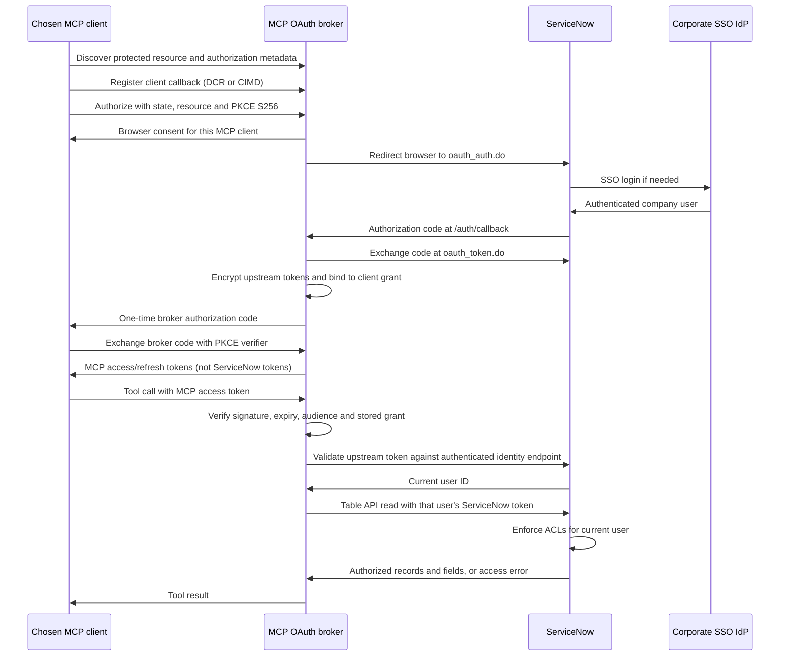

# ServiceNow end-user authorization over remote MCP

## Objective and scope

Allow users to choose an OAuth-capable remote MCP client and access ServiceNow
with their own account permissions. Deploy one Streamable HTTP endpoint over
HTTPS. Corporate SSO is used through ServiceNow's existing login integration;
ServiceNow remains the authority for roles, record ACLs, field ACLs, and API access.

This POC is a separate, read-only entry point: `python -m servicenow_mcp.servers.remote`.
It exposes `list_records` and `get_record` for `incident`, `task`, `sc_task`,
`problem`, and `change_request`. It does not grant roles, accept user IDs as
identity assertions, impersonate users, or use the local integration account.
The existing stdio entry point and write-preview tools are separate.

If HR records are in `sn_hr_core_case` rather than `incident`, that table is not
exposed by this POC. A reviewed table allowlist extension would be needed.
UI visibility alone is not a security rule: verify that record and field ACLs
actually enforce the intended restriction for REST requests.

## Architecture



FastMCP 4.0.5 `OAuthProxy` implements discovery, client registration, consent,
PKCE, state, code exchange, signed MCP reference tokens, refresh, and token
lookup. We provide a ServiceNow-specific upstream token verifier. Tokens are
validated with an identity endpoint on every authenticated request, without an
identity/role cache. Tool calls create a fresh client from the verified request
context, including when synchronous tools run in a worker thread.

There are two independent trust boundaries:

| Boundary | Credential | Enforcement |
| --- | --- | --- |
| Client → MCP | Broker-issued access token for `https://mcp.example.com/mcp` | Broker signature, expiry, audience, stored grant, approved callback, upstream validation |
| MCP → ServiceNow | User's ServiceNow access token | ServiceNow authentication, API restrictions and ACLs |

Raw ServiceNow tokens cannot authenticate directly to `/mcp`. No upstream secret
is returned as a tool result. The corporate IdP's login session is not itself
a ServiceNow API credential. Each client authorization obtains a separate grant;
an existing SSO session can avoid another password prompt, but consent may still
be required. Direct IdP authorization and identity-assertion/token-exchange grants
are outside this POC.

## ServiceNow setup

Perform this setup in a test instance with corporate SSO enabled. The repository
contains the resource script, not an automatically deployed ServiceNow application.

1. Create an OAuth API endpoint for external clients in Application Registry.
   Enable the authorization-code flow and configure the **broker** redirect URI:
   `https://mcp.example.com/auth/callback`. The MCP clients' individual callbacks
   belong in the broker's allowlist, not this ServiceNow registration.
2. Record the client ID/secret in `.env.remote`. No user access or refresh token
   belongs in that file.
3. Create a Scripted REST API with an authenticated GET resource `/me`. The
   example expected path is `/api/x_mcp_poc/identity/me`; ServiceNow's generated
   namespace may differ. Put the actual path in `POC_IDENTITY_PATH`.
4. Require authentication at both API and resource levels, and ensure the
   endpoint's REST access rules permit the test users. Do not require admin or
   grant broad user-table read access. Use [poc_identity.js](../servicenow/poc_identity.js).
   It returns only the current caller's ID and username, checks their active flag,
   and rejects guests. Configure OAuth endpoint restrictions/scopes, if used on
   your instance, to allow both this endpoint and the intended Table API reads.
5. Verify the identity response with a personal OAuth token:
   `{"result":{"sys_id":"<32 lowercase hex characters>","user_name":"user.a"}}`.
   ServiceNow adds the `result` envelope around `response.setBody`; the script
   intentionally supplies the inner object. Unauthenticated requests must fail.
6. Verify end-user ACLs independently with direct Table API calls. Do not change
   roles merely to make the POC work. API access may be more restrictive than UI
   access because of web-service and endpoint restrictions.

The broker is a confidential ServiceNow OAuth client and authenticates with its
client secret. Upstream PKCE forwarding defaults to false: some ServiceNow
releases treat a PKCE challenge as public-client mode and reject a client secret
at token exchange. Enable `POC_FORWARD_PKCE=true` only after verifying that your
instance supports PKCE together with confidential clients. Client-to-broker PKCE,
consent and state validation remain required in either mode. The broker does not
forward the MCP `resource` indicator to ServiceNow,
whose OAuth endpoint is not assumed to implement MCP resource indicators.
The POC requests no additional OAuth scopes. Instance-specific scope setups must
be validated before use; the POC does not infer roles from OAuth scope strings.

## Run the POC

Use Python 3.11+ and a dedicated environment with the remote extra:

```bash
python3 -m venv .venv-remote
.venv-remote/bin/python -m pip install -e ".[remote]"
cp -n .env.remote.example .env.remote
```

Generate independent keys, place the outputs in `POC_SIGNING_KEY` and
`POC_ENCRYPTION_KEY`, and protect `.env.remote` with mode 600. Do not share outputs:

```bash
.venv-remote/bin/python -c 'import secrets; print(secrets.token_urlsafe(48))'
.venv-remote/bin/python -c 'from cryptography.fernet import Fernet; print(Fernet.generate_key().decode())'
chmod 600 .env.remote
```

Set the instance, public HTTPS origin (without `/mcp`), client credentials,
identity path, and approved client callbacks. `POC_ALLOWED_REDIRECT_URIS` is a
comma-separated list of exact HTTPS or loopback HTTP callback URLs. There is no
default wildcard. Use the actual callback documented or used by each client.
Environment variables override `.env.remote`. Run from the directory containing
that file, or set `MCP_REMOTE_ENV_FILE` to its absolute path. For a reproducible
remote runtime in `.venv`, use `uv sync --locked --no-dev --extra remote`.

```bash
.venv-remote/bin/python -m servicenow_mcp.servers.remote
```

The process binds to `127.0.0.1:8000`. Terminate TLS using a reverse proxy on the
same host. A minimal Caddy configuration is provided in
[Caddyfile.poc](../deploy/Caddyfile.poc); replace its hostname with your configured
public origin and provision DNS/network access. All OAuth paths and `/.well-known`
paths must be proxied, not just `/mcp`. Preserve the public Host header.
HTTPS applies to both the browser authorization routes and MCP endpoint.

The POC uses stateless HTTP with JSON responses for these request/response tools.
It has no GET notification stream and no legacy `/sse` endpoint. OAuth grant
state is persistent even though MCP transport sessions are stateless.

## Connect a client

Choose a client supporting Streamable HTTP, OAuth authorization code with PKCE,
and a registration mechanism exposed by this server (DCR or CIMD). Configure:

```text
URL:       https://mcp.example.com/mcp
Transport: Streamable HTTP
Auth:      OAuth / automatic discovery
```

The client discovers the broker, opens consent, and redirects through ServiceNow
SSO. It stores its own MCP tokens. Never paste a ServiceNow password/token into
chat or configure a shared API token as an alternative authentication method.
Client configuration syntax and network reachability differ: cloud-hosted clients
need the endpoint reachable from their cloud, while local clients connect from
the user's device. Client compatibility must be tested individually; supporting
MCP tools alone does not guarantee OAuth support.

Useful endpoints:

| Path | Purpose |
| --- | --- |
| `/mcp` | Protected Streamable HTTP tools |
| `/.well-known/oauth-protected-resource/mcp` | Resource metadata |
| `/.well-known/oauth-authorization-server` | Broker metadata |
| `/register` | Dynamic client registration |
| `/authorize`, `/consent`, `/token` | Browser authorization and token exchange |
| `/auth/callback` | ServiceNow → broker callback |

## Verification and limits

For the full automated suite, install the locked development environment with
`uv sync --locked --all-extras --group dev` and run `uv run --locked pytest -q`. The automated tests use fake
ServiceNow responses; they do not create live records or change instance roles.
They exercise actual HTTP discovery/consent/callback/token routes, PKCE failure,
code replay, tampering, audience validation, direct upstream-token rejection,
approved callbacks, concurrent user contexts, upstream refresh, revocation,
encrypted storage and restart continuity, and propagated API access errors.
They verify credential routing, not the correctness of your live ACL rules.

Before accepting the live POC, use two non-admin users with different ACLs:

| Check | Expected |
| --- | --- |
| A lists incidents without an HR filter | Only ACL-readable records/fields returned |
| A gets a forbidden record by known sys_id | No protected record returned |
| A requests a forbidden field explicitly | No protected field returned |
| A and B read concurrently, including through different clients | Each gets only their authorized data |
| A's ServiceNow token is revoked/account disabled | Subsequent requests fail closed; B still works |
| Client refreshes its MCP grant | Same user's upstream credential remains bound |
| Broker restarts with the same keys/store | Existing unexpired grants still work |
| Client attempts a write | No write tool exists; outbound client also rejects non-GET requests |

No live SSO, client GUI, HTTPS deployment, or instance ACL verification is implied
by passing the mock tests. The Scripted REST resource needs instance deployment
and verification, including namespace and authentication settings.

Local state is encrypted with an explicit independent Fernet key under
`POC_STORAGE_DIR` (default `.oauth-poc`, ignored by Git). Keep keys stable across
restarts and back up keys/store together in protected storage. Losing either
requires reauthorization; rotating keys without migration also requires it.
Run one worker: file storage and process-local refresh locks are not a distributed
authorization database. Use restrictive directory permissions; the launcher sets
umask 077. Keep OAuth query strings, secrets, codes and authorization headers out
of proxy/access/debug logs. The sample proxy does not enable access logging.

Production follow-ups: reviewed shared storage with distributed refresh locking,
secret management/key rotation, registration/authorization rate limits, client
approval policy, token redaction, audit correlation without sensitive payloads,
revocation/logout behavior, instance-specific OAuth scopes, and client compatibility.
Write support additionally requires binding previews to the authenticated user,
adapting the existing session-based confirmation mechanism for stateless HTTP,
and enforcing user authorization again at confirmation time.

### Token exchange troubleshooting

If ServiceNow returns `server_error: access_denied`, verify the registered callback
matches the current public origin plus `/auth/callback`, the app is active, and
the local client secret is the actual secret rather than a masked display value.
For this broker, the ServiceNow application should be a confidential client.
If instance OAuth logs report a client-secret failure in public-client mode,
ensure `POC_FORWARD_PKCE=false` and restart the broker. Start a fresh client
authorization; old authorization codes cannot be reused. Never grant admin or
change record ACLs to resolve a token-exchange error.

## References

- [MCP authorization](https://modelcontextprotocol.io/specification/latest/basic/authorization)
- [MCP transports](https://modelcontextprotocol.io/specification/2025-11-25/basic/transports)
- [FastMCP OAuth proxy](https://gofastmcp.com/servers/auth/oauth-proxy)
- [ServiceNow SSO authorization workflow](https://www.servicenow.com/docs/r/platform-security/authentication/authorization-workflow.html)
- [ServiceNow REST API security](https://www.servicenow.com/docs/r/api-reference/rest-api-explorer/c_RESTAPI.html)
- [ServiceNow scripted REST response envelope](https://www.servicenow.com/docs/r/api-reference/rest-api-explorer/c_SpecifyContentType.html)
